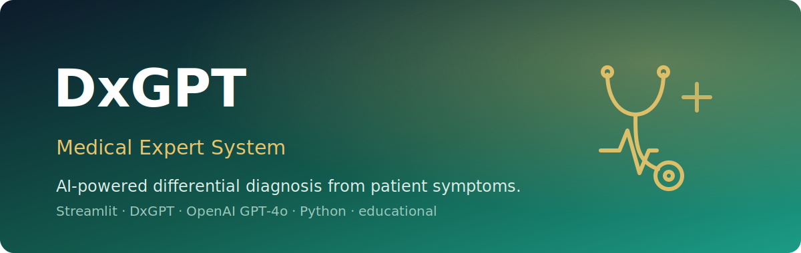

<p align="center">
  
</p>

<h1 align="center">DxGPT — Medical Expert System</h1>

<p align="center"><em>An AI-powered differential diagnosis assistant that turns patient symptoms into ranked clinical hypotheses — for education only.</em></p>

<p align="center">
  
  
  
  
  
</p>

**DxGPT** is a single-file **Streamlit** web app that takes a list of patient symptoms plus optional clinical context (age, sex, duration, comorbidities, medications, and more) and returns the **top 3 differential diagnoses**, each with matching symptoms, non-typical symptoms, a heuristic probability, and clinical reasoning. It can route requests to either the **DxGPT** medical API (Azure API Management) or **OpenAI GPT-4o** as a fallback, and surfaces red-flag warnings and medical disclaimers throughout the UI.

> Built to demonstrate symptom-driven clinical reasoning with LLMs — a teaching tool, never a replacement for a clinician.

> [!WARNING]
> **For EDUCATIONAL PURPOSES ONLY.** This tool is not intended for actual medical diagnosis or treatment. Always consult a qualified healthcare professional. For emergencies, call your local emergency services immediately.

---

## ✨ Features

- **Symptom input** — enter 4–10 comma-separated symptoms in a simple text area.
- **Optional clinical context** — age group, sex, pregnancy status, duration, onset, fever, comorbidities, medications, allergies, smoking status, and recent travel.
- **Dual AI backends** — DxGPT medical API (primary) or OpenAI GPT-4o (alternative/fallback).
- **Top 3 differential diagnoses** — each with a heuristic probability, matching vs. non-typical symptoms, and clinical rationale.
- **Heuristic probability scoring** — ranks candidates by overlap between the user's symptoms and each diagnosis's matching/non-matching lists.
- **Safety first** — built-in red-flag warnings and prominent medical disclaimers.

## 🏗️ Architecture

```
Symptoms + clinical context (Streamlit UI)
                │
                ▼
   normalize + build description string
                │
        ┌───────┴────────┐
        ▼                ▼
  DxGPT API         OpenAI GPT-4o
 (Azure APIM)     (JSON-mode prompt)
        └───────┬────────┘
                ▼
   extract diagnosis items (top 3)
                │
                ▼
   heuristic probability scoring
                │
                ▼
  ranked results + red flags + disclaimer
```

Everything lives in a single module, `DxGPT_Medical_Expert_System.py`, organized around the `MedicalExpertSystem` class (input normalization, API clients, scoring, and result rendering).

## 🚀 Run it

**Prerequisites:** Python 3.8+ and at least one API key (DxGPT subscription key or OpenAI API key).

```bash
# 1. Set up a virtual environment
python -m venv venv
# Windows:
venv\Scripts\activate
# macOS/Linux:
source venv/bin/activate

# 2. Install dependencies
pip install -r requirements.txt

# 3. Launch the app
streamlit run DxGPT_Medical_Expert_System.py
```

The app opens at `http://localhost:8501`. Enter symptoms, optionally expand the clinical context panel, pick a model, and click **Generate Differential Diagnosis**.

## 🔧 Config

Create a `.env` file in the project root with at least one provider configured:

```env
# DxGPT API (primary)
DXGPT_SUBSCRIPTION_KEY=your_dxgpt_subscription_key_here
DXGPT_BASE_URL=https://dxgpt-apim.azure-api.net/api

# OpenAI API (alternative)
OPENAI_API_KEY=sk-proj-your_openai_api_key_here
```

| Variable | Required | Purpose |
|---|---|---|
| `DXGPT_SUBSCRIPTION_KEY` | one of the two | Auth key for the DxGPT Azure API |
| `DXGPT_BASE_URL` | optional | Defaults to `https://dxgpt-apim.azure-api.net/api` |
| `OPENAI_API_KEY` | one of the two | Auth key for OpenAI GPT-4o |

## 📦 Stack

`Python` · `Streamlit` · `requests` · `python-dotenv` · `openai` · DxGPT medical API · OpenAI GPT-4o

---

<p align="center"><em>This project is for educational and research purposes only and must never replace professional medical consultation.</em></p>
